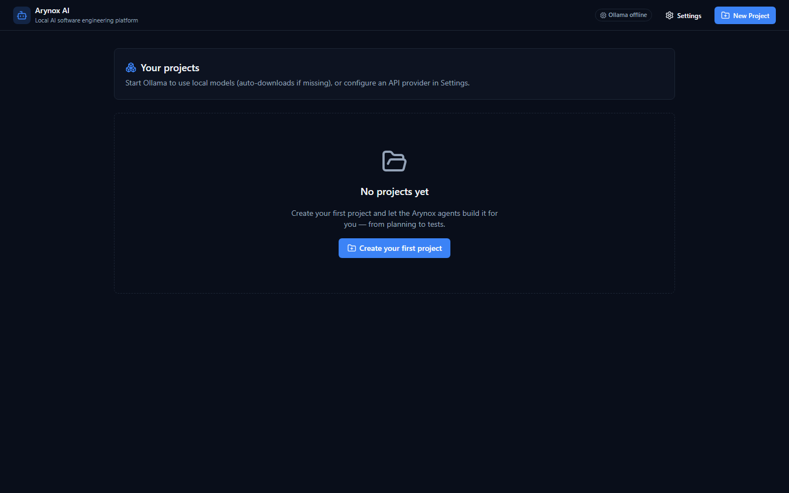
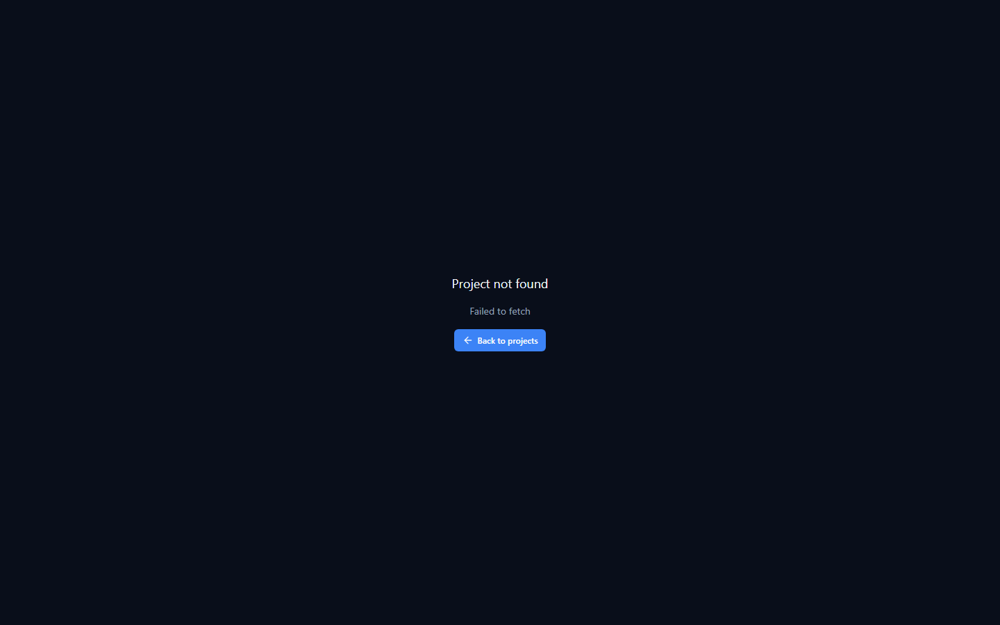
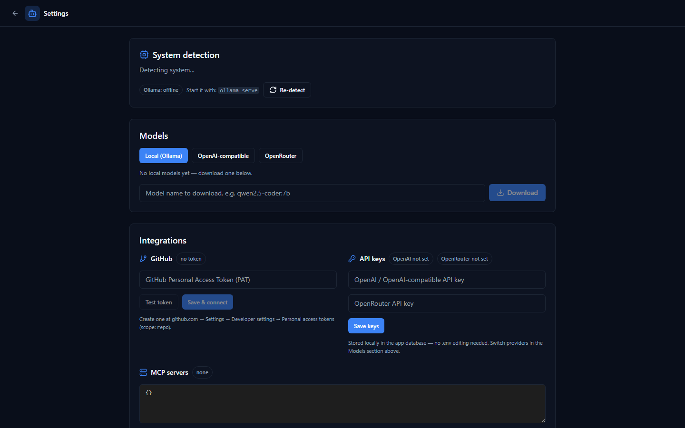

# Arynox AI

**Local-first AI software engineering platform.**

[](https://github.com/aryaanchavan1-commits/open-agent-ide/actions/workflows/ci.yml)
[](LICENSE)
[](https://www.python.org/)
[](https://nodejs.org/)
[](https://fastapi.tiangolo.com/)
[](https://nextjs.org/)

Describe a software project in natural language — Arynox AI plans it, designs its architecture, breaks it into tasks, and specialized AI agents write the code, run the tests, and debug the failures, all inside an isolated local workspace with an IDE-style web UI.

Everything runs on `localhost`. No cloud, no account, no data leaves your machine (unless you configure a hosted API provider or push to GitHub).

## Screenshots

| Project list | IDE workspace | Settings & integrations |
|---|---|---|
|  |  |  |

## Features

- **8 specialized AI agents** orchestrated automatically:
  🧠 Planner · 📋 Product Manager · 🏗️ Architect · 💻 Coding · 🧪 Testing · 🐛 Debugging · 🔍 Code Review · 📝 Documentation
- **Multi-provider AI layer** — Ollama (local, auto-downloads missing models), any OpenAI-compatible API, OpenRouter, plus **MCP** server tool support. Switch providers without touching agent code.
- **IDE-style UI** — Monaco code editor, file explorer, tasks, agent status, AI chat, terminal, test results, git panel, diff review.
- **Safety-first**: every agent action is reviewable. Commands go through an allowlist/denylist with three permission modes (`safe`, `ask`, `auto`) and an approve/reject flow.
- **Approval-based changes**: the AI proposes file changes as diffs; you review and apply.
- **Git-native**: auto-initialized repos, commits, branches, checkpoints — every AI change is reversible, and checkpoints can be restored. Optional **auto-push to GitHub**.
- **Integrations**: GitHub PAT (push any workspace to your repos), runtime API keys (no `.env` editing), MCP server config with live reconnect.
- **Agent memory**: context selection only feeds relevant files to the model (keyword scoring; RAG-ready architecture).
- **Streaming**: SSE for agent status, chat, terminal output, test progress, and model downloads.

## Quick start

### 1. Start Ollama (for local models)

```bash
ollama serve
```

Arynox will detect the server and **automatically download** the model when it is missing (the recommended model is picked from your system — OS, RAM, GPU — e.g. `qwen2.5-coder:7b`). You can also download any model from the Settings page.

> No Ollama / no model yet? Any OpenAI-compatible API or OpenRouter works — just set the keys in Settings → Integrations.

### 2. Backend

```bash
cd backend
python -m venv .venv
.\.venv\Scripts\activate          # Windows
# source .venv/bin/activate       # macOS / Linux
pip install -r requirements.txt
cp .env.example .env              # then edit if needed
uvicorn app.main:app --reload
```

### 3. Frontend

```bash
cd frontend
npm install
npm run dev
```

Open **http://localhost:3000**, create a project, and describe your application — e.g. *"Create a FastAPI backend for a pharmacy inventory system with products, stock levels and low-stock alerts."*

Other URLs:
- Backend API: http://localhost:8000
- API docs (Swagger): http://localhost:8000/docs

### Windows one-click (EXE)

No Python or Node required. Download **`Arynox.exe`** from the [latest release](https://github.com/aryaanchavan1-commits/open-agent-ide/releases/latest) and double-click it. The launcher:

1. Starts Ollama automatically (if installed) for local models
2. Runs the embedded backend and IDE (data lives in `%LOCALAPPDATA%\Arynox AI`)
3. Opens the app at **http://localhost:8000**

Without Ollama, use OpenAI / OpenRouter providers from **Settings → Integrations**.

### Windows one-click (source)

Double-click [`run.bat`](run.bat) — it starts Ollama (if installed), the backend, the frontend, and opens the browser.

## Architecture

```
┌──────────────┐     ┌──────────────────────────────────────────────┐
│  Next.js IDE │ ──► │                  FastAPI                      │
│  Monaco      │     │  ┌────────────────────────────────────────┐  │
│  SSE client  │ ◄── │  │ Orchestrator (intent → agent sequence)  │  │
└──────────────┘     │  │ ┌──────┐ ┌────────┐ ┌───────┐ ┌──────┐ │  │
                     │  │ │ PM   │ │Architect│ │Planner│ │Coder │ │  │
                     │  │ └──────┘ └────────┘ └───────┘ └──┬───┘ │  │
                     │  │   Tester · Debugger · Reviewer · Docs    │  │
                     │  │                 │                        │  │
                     │  │ ┌───────────────┴───────────────┐        │  │
                     │  │ │ Tool registry (files, shell,   │        │  │
                     │  │ │ MCP) + command safety layer   │        │  │
                     │  │ └───────────────┬───────────────┘        │  │
                     │  └─────────────────┼────────────────────────┘  │
                     │        ┌───────────┴───────────┐              │
                     │        │ Providers: Ollama /    │  ┌───────┐  │
                     │        │ OpenAI-compat / OpenRouter │ SQLite│  │
                     │        └───────────┬───────────┘  └───────┘  │
                     └────────────────────┼─────────────────────────┘
                                          ▼
                              Project workspaces (git repos)
```

See [docs/ARCHITECTURE.md](docs/ARCHITECTURE.md) for the full design: provider abstraction, agent system, tool registry, security layer, streaming, and data model.

## API reference

| Method | Endpoint | Purpose |
|---|---|---|
| `GET` | `/health` | Health check |
| `GET/POST` | `/api/projects`, `/api/projects/{id}` | Project CRUD |
| `POST` | `/api/projects/{id}/chat` | Send a request to the AI orchestrator |
| `GET` | `/api/projects/{id}/events` | SSE stream (runs, chat, terminal, downloads) |
| `GET/POST` | `/api/projects/{id}/files/...` | Read/write/edit/delete/list files (workspace-jailed) |
| `GET/POST` | `/api/projects/{id}/git/...` | Status, commit, branches, checkpoints, log, restore |
| `GET/POST` | `/api/projects/{id}/tasks` | Task planning list |
| `GET` | `/api/projects/{id}/agents`, `/agents/run` | Agent listing & manual run |
| `POST` | `/api/projects/{id}/execute` | Run a command (permission-gated) |
| `POST` | `/api/projects/{id}/approvals/.../respond` | Approve/reject commands & plan changes |
| `GET` | `/api/models/system-check` | Detect OS/RAM/GPU + recommend a model |
| `GET` | `/api/models/available` | List provider models |
| `POST` | `/api/models/pull` | Download an Ollama model |
| `POST` | `/api/models/test` | Verify a model responds |
| `GET/POST` | `/api/settings` | Project settings (permission mode, model) |
| `GET` | `/api/integrations/status` | Configured integrations |
| `POST` | `/api/integrations/keys` | Save API keys (encrypted at rest) |
| `POST` | `/api/integrations/github/test\|save` | Validate & store a GitHub PAT |
| `GET` | `/api/integrations/github/repos` | List your repositories |
| `POST` | `/api/integrations/github/push` | Push a project workspace to GitHub |
| `GET/POST` | `/api/integrations/mcp` | Read / save & reconnect MCP servers |
| `POST` | `/api/integrations/auto-push` | Toggle auto-push after agent runs |

Interactive docs: http://localhost:8000/docs

## Providers

Set the provider in `backend/.env` (see `.env.example`):

| Provider | `AI_PROVIDER` | Notes |
|---|---|---|
| Ollama (local) | `ollama` | Auto-pulls missing models from `OLLAMA_BASE_URL` |
| OpenAI-compatible | `openai` | Any `/v1/chat/completions` endpoint (OpenAI, LM Studio, vLLM, Groq...) |
| OpenRouter | `openrouter` | One key, hundreds of models |

### Integrations (Settings → Integrations)

Everything can also be configured at runtime from the Settings UI — no `.env` editing:

- **GitHub (PAT)** — paste a personal access token (scope `repo`), test it, save it, and push any project workspace to one of your repositories from the project's Git panel.
- **API keys** — set the OpenAI / OpenRouter keys at runtime; provider connections refresh immediately. Keys are **encrypted at rest**.
- **MCP servers** — edit the server map as JSON and reconnect on the fly.
- **Auto-push** — enable "auto-push to GitHub after every agent run": once an agent run finishes, the workspace is committed and pushed automatically (requires a connected GitHub token).

### MCP servers

Configure servers as JSON in `MCP_SERVERS` (or via Settings → Integrations):

```env
MCP_SERVERS={"filesystem":{"command":"npx","args":["-y","@modelcontextprotocol/server-filesystem","C:\\projects"]}}
```

Tools exposed by MCP servers are registered automatically and available to agents.

## Security model

- **Optional API token**: set `ARYNOX_API_TOKEN` in `backend/.env` to require the `X-API-Token` header on all API calls (the frontend sends it automatically when `NEXT_PUBLIC_API_TOKEN` is set). Generate one with `python -c "import secrets; print(secrets.token_urlsafe(32))"`. Localhost-only access is the default.
- **Secrets at rest**: API keys and GitHub tokens saved from the UI are encrypted with a per-install key (`backend/.secrets_key`, gitignored) before being written to SQLite.
- **HTTPS**: the app is designed for `localhost` (HTTP). For remote access, put a reverse proxy (Caddy/nginx) in front of the backend or run uvicorn with `--ssl-keyfile/--ssl-certfile`.
- All file tools are jailed to the project workspace (path traversal blocked).
- Command execution uses an allowlist + denylist. Dangerous commands (`rm -rf /`, `format`, `shutdown`, credential exfiltration, fork bombs, `git push`...) are always blocked.
- Permission modes: **Safe** (allowlist only) · **Ask** (default — every non-allowlisted command requires your approval) · **Auto** (approve everything non-denied).
- Every approval dialog shows: command, working directory, requesting agent, and reason.

## Project workspace layout

```
projects/
  my-project/
    source/          # the generated application (agents work here)
    .arynox/         # internal platform metadata
    logs/            # run logs
    tests/           # test workspace
```

## Development

```bash
# backend tests
cd backend && .\.venv\Scripts\python -m pytest tests -q

# frontend typecheck / build
cd frontend && npx tsc --noEmit && npm run build
```

CI runs both plus the Docker image builds on every push (see [.github/workflows/ci.yml](.github/workflows/ci.yml)).

Docker (optional, verify with the CI "Docker images build" job):

```bash
docker-compose up --build
```

## Contributing

See [CONTRIBUTING.md](CONTRIBUTING.md) — setup, code style, and the PR checklist. Bug reports and feature requests use the [issue templates](.github/ISSUE_TEMPLATE).

## Roadmap

- Embeddings/RAG for agent memory
- WebSocket terminal (xterm.js)
- Multi-session agent parallelism
- Postgres support & multi-user auth

## License

[MIT](LICENSE) © 2026 Aryan Chavan
